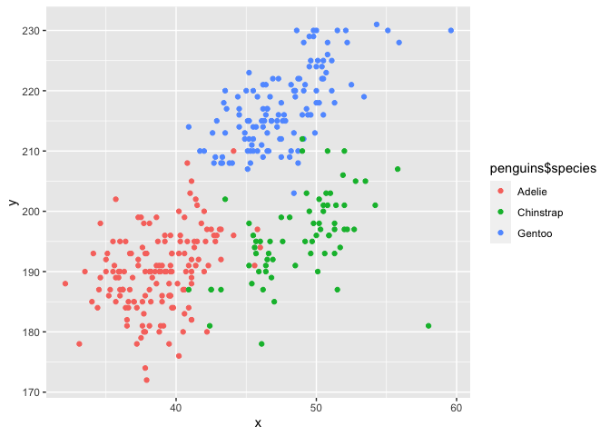

p8105\_hw1\_kx2173
================
ke
9/26/2021

## Problem 1

Firstly, I create a data frame.

``` r
# Make sure the randomly generated values are same and reproducible

set.seed(1)

# Create a data frame

pro1_df = tibble(
  vec_num = rnorm(10),
  vec_logical = if_else(vec_num > 0, TRUE, FALSE),
  vec_char = c("First", "Second", "Third", "Forth", "Fifth", "Sixth", "Seventh", "Eighth", "Ninth", "Tenth"),
  vec_factor = factor(c("A", "B", "C", "B", "A", "C", "B", "B", "C", "A"))
)

# Call data frame

pro1_df
```

    ## # A tibble: 10 × 4
    ##    vec_num vec_logical vec_char vec_factor
    ##      <dbl> <lgl>       <chr>    <fct>     
    ##  1  -0.626 FALSE       First    A         
    ##  2   0.184 TRUE        Second   B         
    ##  3  -0.836 FALSE       Third    C         
    ##  4   1.60  TRUE        Forth    B         
    ##  5   0.330 TRUE        Fifth    A         
    ##  6  -0.820 FALSE       Sixth    C         
    ##  7   0.487 TRUE        Seventh  B         
    ##  8   0.738 TRUE        Eighth   B         
    ##  9   0.576 TRUE        Ninth    C         
    ## 10  -0.305 FALSE       Tenth    A

Then, I extract each variable and calculate means, however, some mean
output are “NA”

``` r
# Extract each variable and calculate means

ext_num = pull(pro1_df, vec_num)
# the mean of the variable "vec_num" is 0.1322028
mean(ext_num)
```

    ## [1] 0.1322028

``` r
ext_logical = pull(pro1_df, vec_logical)
# the mean of the variable "vec_logical" is 0.6
mean(ext_logical)
```

    ## [1] 0.6

``` r
ext_char = pull(pro1_df, vec_char)
# This doesn't work, because this is not a numerical or logical argument
mean(ext_char)
```

    ## Warning in mean.default(ext_char): argument is not numeric or logical: returning
    ## NA

    ## [1] NA

``` r
ext_factor = pull(pro1_df, vec_factor)
# This doesn't work, because this is not a numerical or logical argument
mean(ext_factor)
```

    ## Warning in mean.default(ext_factor): argument is not numeric or logical:
    ## returning NA

    ## [1] NA

In order to fix that, I use as.numeric to convert my logical, character
and factor variables, but only logical and factor variables worked.

``` r
# Convert variable to numerical variables and calculate the mean

# all elements are "NA" after converting
num_char = as.numeric(ext_char)

# all elements in ext_factor are converted to "1,2,and 3" after converting
num_factor = as.numeric(ext_factor)
# mean = 2
mean(num_factor)

# converted to "1 and 0", 1 for TRUE and 0 for FALSE
num_logical = as.numeric(ext_logical)
# mean = 0.6
mean(num_logical)
```

## Problem 2

Load the penguin data set

``` r
data("penguins", package = "palmerpenguins")
```

#### Short description:

the names of variables are: species, island, bill\_length\_mm,
bill\_depth\_mm, flipper\_length\_mm, body\_mass\_g, sex, year. The data
set has 344 rows and 8 columns. The mean flipper length is 200.9152047.

Finally, we made a scatterplot.

``` r
# Make a scatter plot
plot_df = tibble(
  x = penguins$bill_length_mm,
  y = penguins$flipper_length_mm,
)

ggplot(plot_df, aes(x = x, y = y, color = penguins$species)) + geom_point()
```

    ## Warning: Removed 2 rows containing missing values (geom_point).

<!-- -->

``` r
# Save the scatter plot to project directory
```
